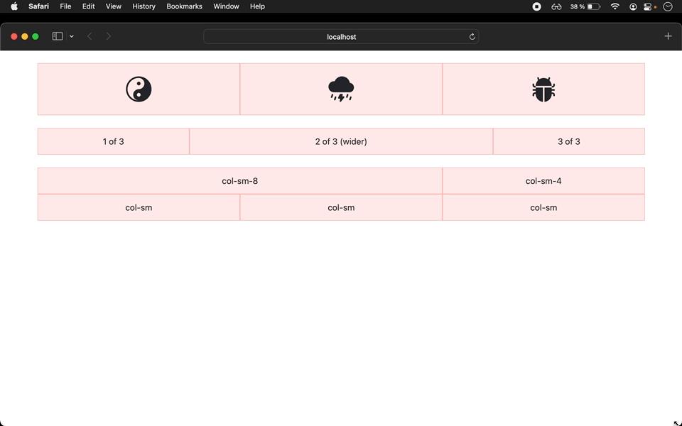

# README

## Install & run

```bash
git clone https://github.com/miguel-coppiloto/angular-bootstrap-plus-icons.git
cd angular-grid-responsive
npm install
ng serve --open
```



### Some important commands

Fresh install

```bash
ng new angular-bootstrap-plus-icons
cd angular-bootstrap-plus-icons
npm install bootstrap bootstrap-icons
```

We need only the CSS, so edit `angular.json` an add in the node `projects > [name-project] > architect > build > options > style`

```bash
"styles": [
  "node_modules/bootstrap/scss/bootstrap.scss",
  "node_modules/bootstrap-icons/font/bootstrap-icons.css",
  "src/styles.scss"
],
```
